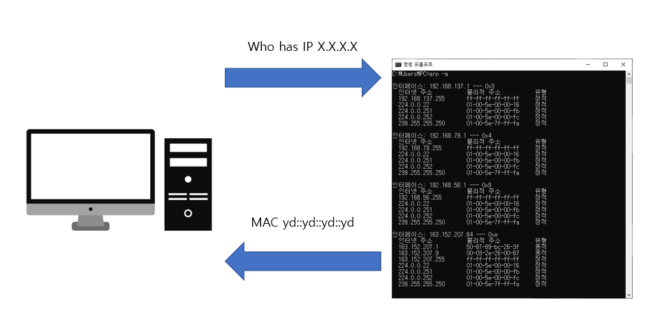
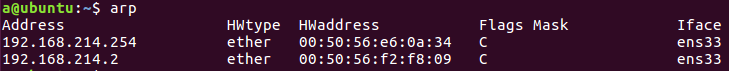
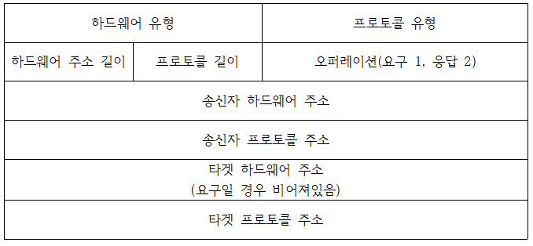
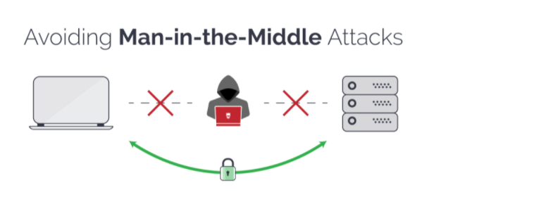
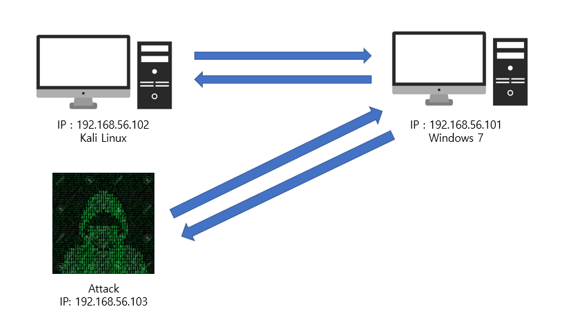
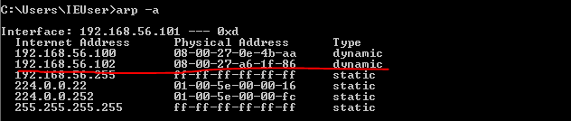
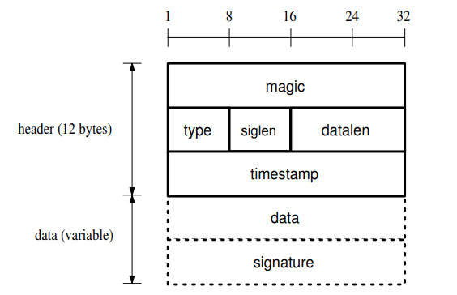
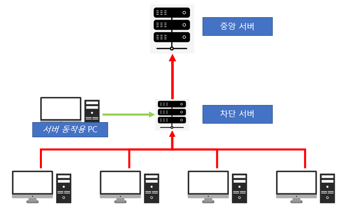

# ARP poisoning 

### 0. What is ARP ??

- ARP는 주소를 해결하기 위한 일종의 프로토콜이다 수신측은 IP 주소를 기반으로 수신측의 호스트의 MAC주소를 알아낼 수 있다. 
- ARP table에 수신측의 IP주소에 대응하는 MAC주소가 있다면 table은 그 정보를 반환한다. 
#### 동작 과정 

- 상황 > 호스트 A가 호스트 B IP 주소를 알고 MAC주소를 알고 싶은 상황 (앞으로 호스트 A는 공격당하는 자로 칭함)
  1. 호스트 A는 네트워크 대역에 위의 그림처럼 '이 IP주소를 가지고 있는 장비있니?' 라는 ARP  request정보를 송신한다. 
  2. 네트워크 대역에 있는 해당 IP를 가지고 있는 장비는 ARP reply를 보낸다. (자신의 MAC 주소를 전송)
  3. ARP reply를 받은 호스트 A는 <IP , MAC> 정보를 자신의 ARP 테이블에 저장을 한다. 이후 통신은 이 ARP table을 참고한 후 통신이 진행이 된다. 
  4. 이 table의 경우 일정 시간이 지나면 없어지므로 , 없어진 순간 다시 1번 과정부터 다시 실행이 된다. (table 형식은 아래 그림참고)

#### ARP 패킷의 형식 

### 1. ARP cache table poisoning

 - ARP protocol은 reply 정보가 들어오면 그 해당 패킷을 보낸 사용자의 신원을 확인 하지 않고 자신의 ARP table을 수정을 한다. 이럴 경우에 패킷을 받은 호스트 A(수신자)는 자신의 Table을 최신으로 들어온 정보로 수정하게 한다. 

#### 공격 시나리오 
  - 호스트 A는 호스트 B의 MAC 주소를 알기 위해서 해당 네트워크 대역에 Broadcast를 한다. 
  - 해당 Packet을 받은 Attacer는 fake <IP , MAC> 주소를 호스트 A(공격당하는 자)를 보낸다.
  - 이 경우 호스트 A는 자신의 ARP table에 호스트 B의 정보를 fake <IP , MAC>으로 수정을 하게 된다. 
  - 호스트 A는 호스트 B(서버라고 가정)에 접속을 시도 하게 되면 Attacker가 만든 fake <IP, MAC>으로 접속을 하게 된다.  

- 이럴 경우에 다음의 나열된 공격을 시도 할 수 있다. 

  1. DoS attack
  2. Host impersonation 
  3. Man-in-the-middle
  4. etc

  #### 1. DoS attack
  - Attack는 호스트 A의 ARP table의 정보를 의 fake <IP, MAC>으로 수정을 하게 되면 실제로 가야하는 목적지에 패킷이 똑바로 전달 되지 못하게 된다. 
  
  #### 2. Host impersonation
  - 1번 공격과 다르게 실제로 통신을 해야하는 호스트 B가 아닌 Attacker가 호스트 B를 가장해서 정보를 빼낼 수 있다. 
  
  #### 3. Man-in-the-middle
  - 동시에 두개의 호스트를 poisoning했을 경우에 두개의 호스트는 자신끼리 통신을 하고 있다고 생각하지만 중간의 공격자가 패킷을 받고 수신하면서 안의 내용을 볼 수 있다. (구조 아래 그림참고)

  #### 4. DDOS(작성자 생각)
  - Attacker가 네트워크의 대역에 있는 모든 호스트들의 ARP table을 호스트 A의 <IP , MAC>으로 감염시키고, 특정 행동을 했을 때 계속해서 호스트 A에게 접속을 하게 되고 이 경우, 네트워크
    규모가 클 경우, 하나의 사용자는 계속해서 많은 패킷을 받기 때문에 정상적으로 작동하기 어려울 것이다. 
  
  
  #### 5. Session hijacking 
  - ARP spoofing 을 이용해서 세션 하이재킹을 이용해서 이용자의 개인정보를 탈취 한다. 

### 2. ARP cache table poisoning 실습

#### vm의 환경 구축

위의 그림을 보면 Kali랑 Windows 7이 통신을 하려하는 데 Attacker가 중간에 ARP spoofing을 하여 Windows 7의 table을 공격한다. 

- 초기 Windows 7 arp table 화면 

### 3.Preventing ARP poisoning 

  #### 3.1 `Preventing` Secure ARP Protocol (S- ARP) 
 
    - [2]에서 제안하고 있는 새로운 알고리즘의 일종이다. 즉 ARP request 나 reply를 보낼 경우에 추가로 인증 패킷을 하나더 보내는 새로운 프로토콜이다.
    - [2]에서 제안하고 있는 S-ARP자체는 ARP spoofing을 막기에는 효과적이지만, 모든 네트워크에 있는 장비들이 모두 S-ARP기능을 갖추어야 하기 때문에 비용적으로 무리가 있다.(OS 수정)
    - 기존의 위에서 봤던 ARP의 패킷의 헤더와는 다르게 아래 그림과 같은 형식이 패킷이 된다
        ※ 맨위의 magic으로 S-ARP 패킷임을 확인을 하고, 중앙 AKD를 통해서 공개키 알고리즘을 이용해서 서로의 ARP packet을 인증을 하는 형식으로 진행이 됨. 
        

  #### 3.2 `Preventing` Static Mac Entries 
    - 우리가 평소에 사용하는 인터넷에서는 솔직히 말하면 거의 불가능한 방법이다. 
    - 모든 사용자는 자신들이 통신하는 IP와 그에 해당하는 MAC을 정부다 가지고 있고, dynamic과 다르게 static은 자동을 수정되지 않고 사용자가 직접 수정을 해야한다. 
    - 이 경우는 앞서 했던 실습에서 살펴 보면 dynamic arp table을 사용을 하면 arp spoofing이 가능하지만, 이 경우는 ARP reply가 와도 ARP table이 수정되지 않는다. 

  #### 3.3 `Preventing` Kernel Based Pataches
    - [2]에서는 커널 자체에서 Anticap과 Antidote라는 Kernel patch를 통해서 ARP spoofing을 막는다고 서술 되어 있다. 
    - 기존의 <IP , MAC> list를 두고 다른 것이 들어왔을 경우에 Blacklist를 관리하듯이 확인후, ban을 하는 방식으로 막게 되어 있다.
      Anti cap 동작 설명
      > table에 정보가 없으면 일단 추가 
      > table에 있는 정보가 들어 왔을 시 sysctl bit가 1로 세팅이되고, 새로 들어온것은 대부분 arp spoofing이라고 판단, 

  #### 3.4 `Detecting and Preventing` Central Secure server 
    - [1]에서 제안된 방식으로 하나의 중앙서버에서 모든 arp table을 관제하고, 인증되지 않은 장비가 ARP request , reply를 진행 할 경우, 중앙서버에 없는 <IP, MAC>일 경우 차단.

### 4. ARP spoofing을 이용한 안전한 인트라넷 구축하기 

사실 ARP spoofing이라는 것이 네트워크를 해킹해서 상대방의 정보를 빼내는 `창` 같은 존재가 될 수도 있지만, 안전한 인트라넷을 구현하기 위한 `방패` 의 역할도 할 수 있다고 생각한다. 
그래서 ARP spoofing을 통해서 안전한 인트라넷을 구축해봤다. 

- 위의 있는 구조 설명 
  1. 중앙서버 : 컴퓨터를 차단하는 각종 정책을 가지고 있으며, 차단 서버가 보내온 정보를 자신의 정책과 맞지 않는 경우, 차단서버에게 차단을 명령한다. 또한 각 PC가 전달하는 정보가 정책에 위반하는 경우가 있다면 이를 차단한다.  
  2. 차단서버 : 일정 네트워크 대역을 관제하고 있고 정책서버가 차단 서버에게 차단을 명령하면, 해당 PC는 인트라넷이용이 불가능 하다. 
  3. 각 PC   : 각 PC는 하나의 프로그램을 깔고, 그 프로그램은 PC의 IP정보, MAC정보 같은 하드웨어적 정보와 , 각 종 소프트웨어에 있는 정보들을 중앙서버에 전달을 한다. 

- 허용되지 않은 사용자가 인트라넷을 사용하려는 경우!
  1. 허용되지 않은 사용자가 인트라넷을 사용하기 위해서 랜선을 자신의 laptop에 연결하고 다른 사용자들의 ARP정보를 얻기 위해 Broadcast함 
  2. 특별한 보안조치가 되어 있지 않다고 가정을 하면 일반 사용자들은 자신의 <IP, MAC> 주소를 허용되지 않은 사용자에게 전달을 함 
  3. 이때 같은 네트워크 대역에 있는 차단서버가 이 broadcast에 있는 <IP, MAC>을 정책서버에게 전달
  4. 정책서버는 허용된 <IP, MAC>인지를 확인하고, 허용되지 않았을 경우에 차단서버에 차단을 명령 
  5. 차단 서버는 정책서버로 부터 차단 명령이 내려오면, 이 때 차단서버는 자신의 ARP 정보포함해서, 네트워크 대역에 있는 IP에 해당하는 모든 MAC들을 차단 서버의 MAC으로 바꾸는 ARP poisoning을 허용되지 않은 사용자의 장비로 패킷을 보낸다.
  6. 결국 허용되지 않은 사용자의 장비는 차단서버의 특정 사이트만 접속 할 수 있게 되고, 인트라넷을 이용하지 못하게 된다. 

위의 허용되지 않은 사용자가 인트라넷을 사용하는 경우, 뿐만 아니라, 기존 사용자가 불법 소프트웨어를 입수를 했다면, 이역시 차단서버가 ARP poisoning을 이용해서 해당 PC의 ARP table을 모두 차단 
서버로 향하게 한다. 

### 5. Reference

[1] Cristina L. Abad , Rafael I. Bonilla(2007) "An Analysis on the Schemes for Detecting and Preventing ARP Cache Poisoning Attacks"  27th International Conference on Distributed Computing Systems Workshops (ICDCSW'07)

[2] Vivek Ramachandran, and Sukumar Nandi(2005) "Detecting ARP Spoofing: An Active Technique" First Internation Conference, ICISS 2005 Kolkata, India, December 2005 Proceedings

[3] Poonam Pandey(2013) "Prevention of ARP Spoofing: A Probe Packet based Technique" 2013 3rd IEEE International Advance Computing Conference (IACC)

[4] D. Bruschi, A. Ornaghi, E. Rosti(2003) "S-ARP: a Secure Address Resolution Protocol" 19th Annual Computer Security Applications Conference, 2003. Proceedings.

